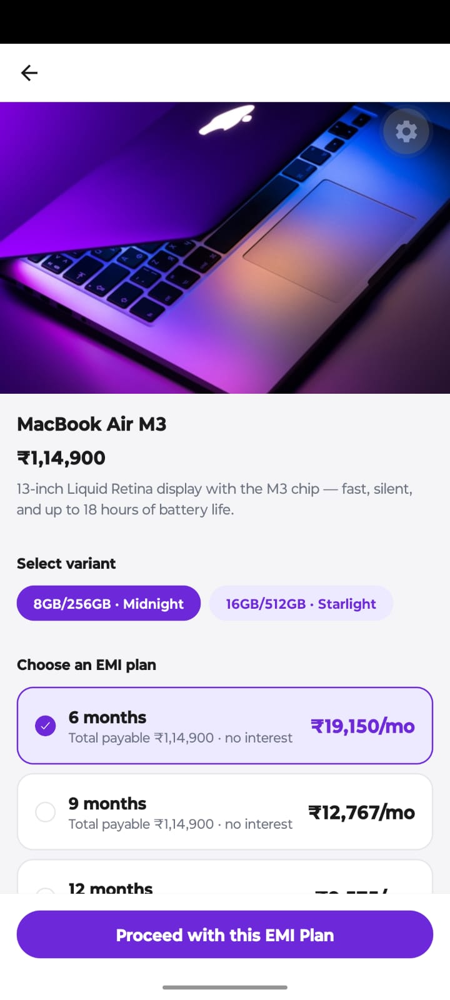
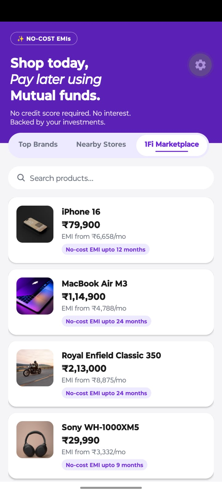

# 1Fi Marketplace — SDE Intern Assignment

A frontend-only implementation of the "1Fi Marketplace" tab on the Shop page,
built with Expo SDK 57 / React Native 0.86 / TypeScript, matching the
existing 1Fi app's design system (purple/violet theme, pill tabs, card lists).

## Screenshots

| Marketplace listing | Product detail — variant & EMI selection |
|---|---|
|  |  |

## Stack
- Expo SDK 57, React Native 0.86, React 19.2
- TypeScript (strict)
- React Navigation (native-stack)
- Mock async data layer (no backend, no real network calls)

## Getting started

```bash
npm install
npx expo install --fix   # aligns every Expo-managed package to SDK 57
npx expo start -c
```

Scan the QR with Expo Go, or press `i` / `a` for iOS/Android simulator.

## Folder structure

```
src/
  theme/            design tokens (colors, spacing, typography) lifted from
                     the existing Shop page screenshot
  types/            Product, Variant, EMIPlan TypeScript interfaces
  data/             mock product + EMI plan dataset (never imported by UI directly)
  services/         marketplaceApi.ts — simulated async "API" layer
                     (latency + randomized failure so error states are real)
  components/       reusable, presentation-only components
                     (ProductCard, SearchBar, ShopTabs, VariantSelector,
                     EMIPlanList, MarketplaceListContent, LoadingState,
                     ErrorState, EmptyState)
  screens/          ShopScreen (hero banner + 3-tab switcher),
                     ProductDetailScreen, ConfirmationScreen,
                     PlaceholderScreen (Top Brands / Nearby Stores)
  navigation/        stack navigator wiring (Shop → ProductDetail → Confirmation)
```

## Design decisions

- **Shop page** now has three tabs: `Top Brands`, `Nearby Stores` (both left
  as empty placeholder screens per the assignment) and `1Fi Marketplace`
  (fully built).
- All product/EMI data flows through `services/marketplaceApi.ts`, which
  simulates network latency (600–900ms) and has an injectable failure rate
  (`setSimulatedFailureRate`) so the loading/error/empty/success states are
  all real and demonstrable, not just visual mockups.
- Swapping the mock layer for a real backend later only requires editing
  `marketplaceApi.ts` — no screen or component needs to change.
- EMI plans are "no-cost": `monthlyAmount * months === totalAmount === price`.

## Demoing the error state

`services/marketplaceApi.ts` exports `setSimulatedFailureRate(rate: number)`.
Call it (e.g. temporarily in `App.tsx`) with `1` to force every request to
fail and see the retry UI, or leave at the default `0.08` for occasional
randomized failures.